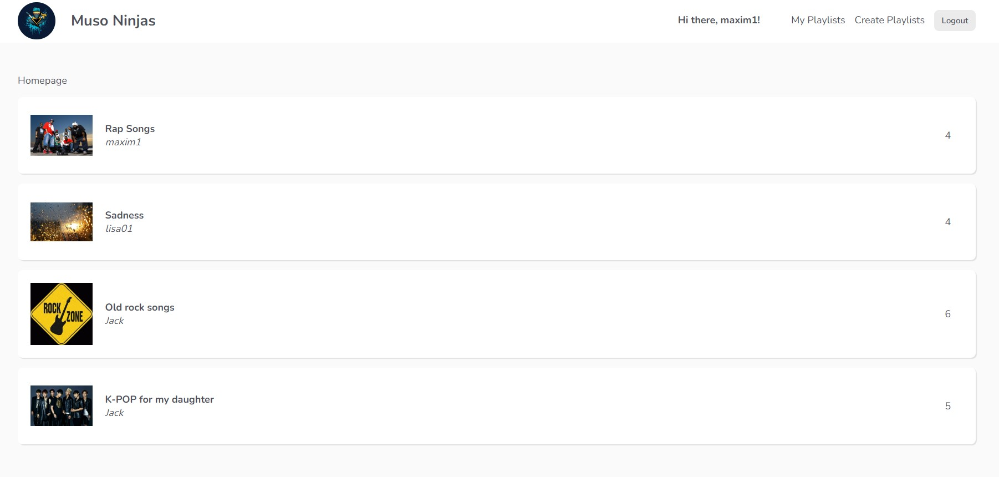
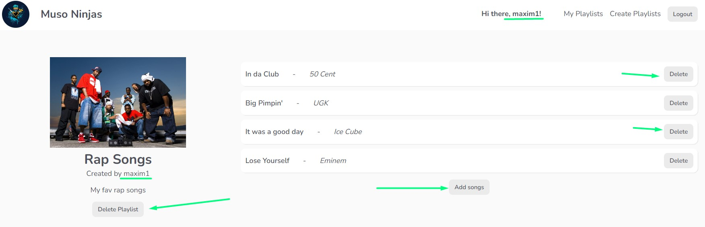
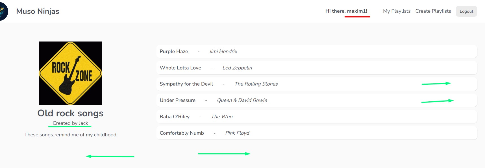
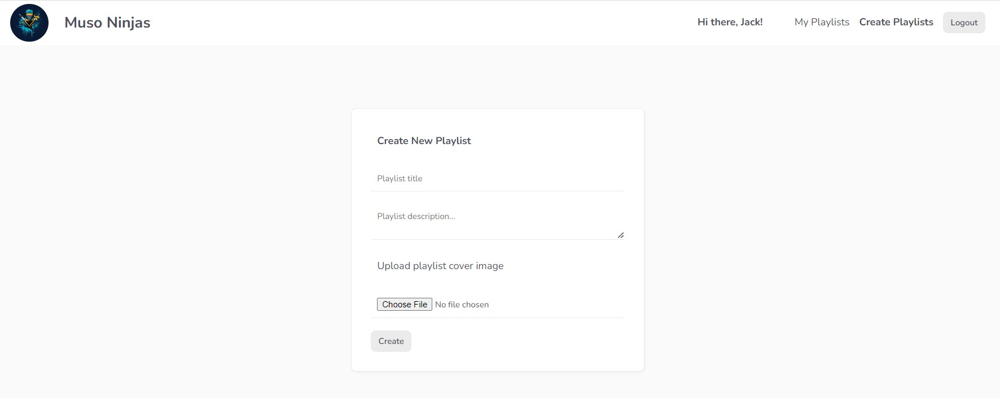
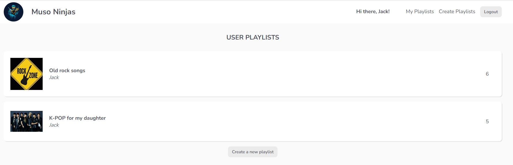

# Share your playlists 🎵



## 📋 Project Description

What's up?

If you are a melophile or you want to find many songs from different people - this APP is for you.
Here you can not only find new songs but share your playlists / songs as well.

❗ I will keep my firebaseConfig so you can check this app, so please respect my work and don't make a mess of it, please.

If you want to share songs only with your friends just change my firebaseConfig to yours.

💻 This project was created via:

- Vue 3 Composition API;
- Firebase for backend;
- VUEX;

## Things than you can use in your projects and make your APP even better ☺️

### Always check if the person who logged in created this playlist

- ✅ If yes, give him full control of changing (deleting / creating / editing) playlists;



- ⛔ If no, limit his/her capabilities, make it read-only for not owner;



### Sign in / Login in

Is there a difference? Just a little bit.

- After user signs in, he will be redirected into "Create Playlists" page, because for now he has no created playlists.



- After user logins in, he will be redirected into "My Playlists" page, because I would assume a user already has some playlists and want to modify / delete them;



## 🆓 Emails and passwords for tests

If you don't want to sign in a new account you can always use one of those:

- Email: maxim1@gmail.com / Password: maxim1
- Email: lisa01@gmail.com / Password: lisa01
- Email: jack01@gmail.com / Password: jack01

🙏 If you use them, please don't make a mess and don't delete songs and playlists.

You can make new playlists with songs and after finishing exploring the app, just delete newly created playlists.

I hope you enjoy using it. If you have any problems or ideas feel free to contact me via:

📱 [Telegram](https://t.me/mackseam)
📧 [Gmail] (efremovmaxim95@gmail.com)

## 🚀 Project setup

```
# install dependencies
npm install

# serve with hot reload at localhost:8080
npm run serve
```

### Compiles and minifies for production

```
npm run build
```

### Customize configuration

See [Configuration Reference](https://cli.vuejs.org/config/).
